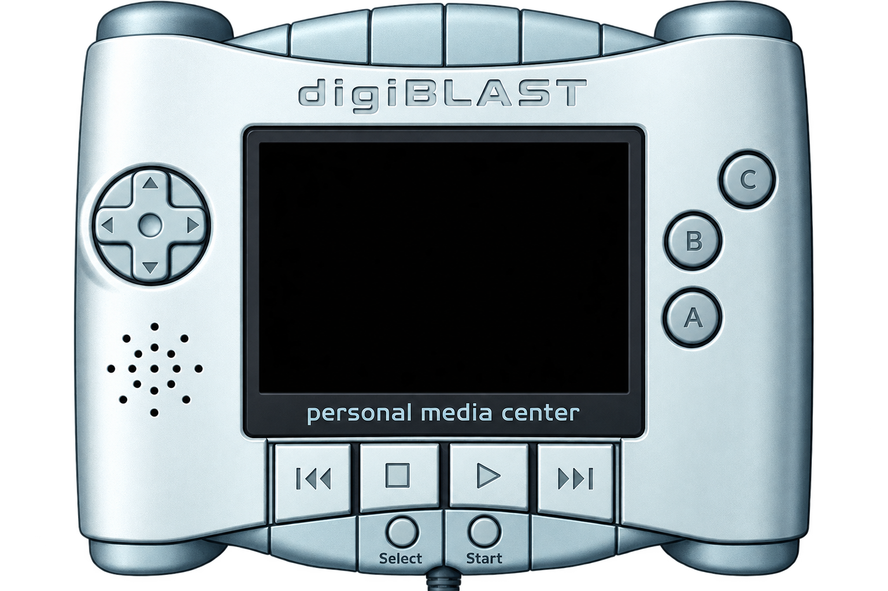
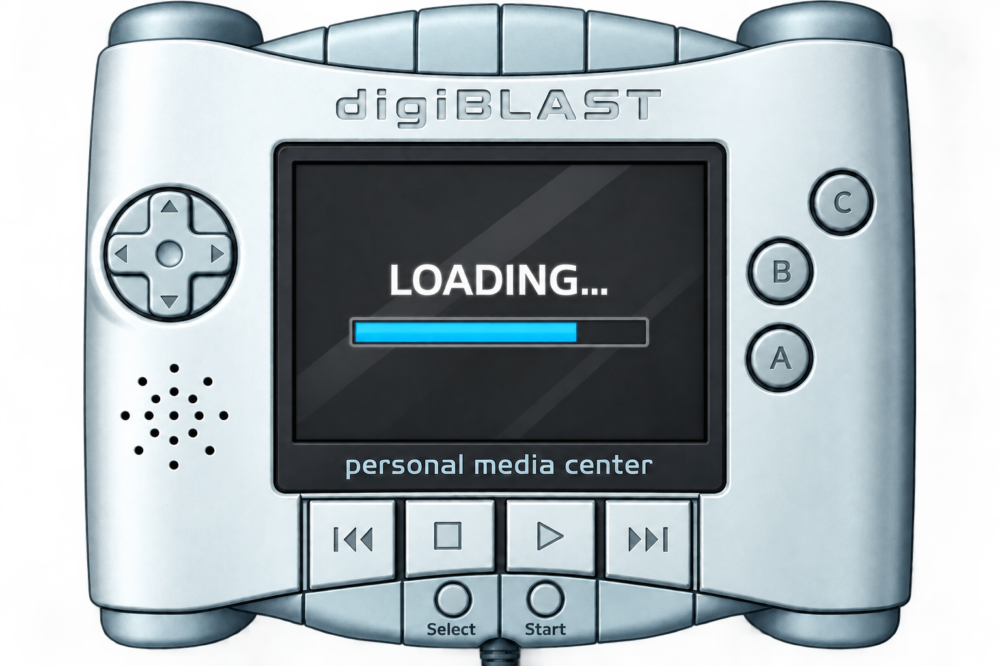

# OceanBlast

<p align="center"></p>

<p align="center">
  <a href="https://github.com/Vashiel/OceanBlast/releases"></a>
  <a href="LICENSE"></a>
  <a href="CHANGELOG.md"></a>
</p>

**OceanBlast** is an open-source, independent research and emulation project targeting the **Nikko digiBLAST** (2005), a European multimedia handheld console powered by the Samsung OCEAN-L-20 System-on-a-Chip (Samsung S3C2410 architecture, ARM920T CPU core).

The goal of this project is digital preservation, architectural documentation, and software interoperability for an obscure and historically undocumented platform.

---

## 🖼️ Interface & Console Skin Preview

| Interactive Console Skin (`--window-mode skin`) | Cartridge Loading Illustration Preview |
| :---: | :---: |
|  |  |

> **Prebuilt Windows Binaries:** Ready-to-run Windows 64-bit builds (`oceanblast.exe` + skin assets) are available on the [**GitHub Releases**](https://github.com/Vashiel/OceanBlast/releases) page.

---

## 🚀 Quick Start & Windows Launcher

Double-click `bin/oceanblast.exe` (or `oceanblast.exe` from a release archive) without arguments to launch the graphical interface:
1. Click **Browse ROM…** and select a legally dumped `.bin` cartridge image.
2. Choose display scaling (**2×**, **3×**, **4×**), window appearance (**Plain Window**, **Console Skin**, or **Fullscreen**; press **F11** / **Alt+Enter** at any time to toggle fullscreen), and leave **Sound** enabled.
3. Click **Start Game**.

Automatic per-cartridge settings are enabled by default (see [docs/34](docs/34_automatic_cartridge_settings.md), [docs/33](docs/33_console_skin_and_fullscreen.md), and [docs/06](docs/06_windows_launcher.md)).

---

## 📊 Cartridge Compatibility Overview (2026-10-10)

All tested cartridges boot autonomously through the 4-KB S3C2410 Steppingstone SRAM, U-Boot 1.1.2 (`nidc` NAND ID & `checkbattery` ADC checks), and the embedded Linux 2.6.11 kernel without kernel panics or guest segmentation faults. Sustained full-speed gameplay and glitch-free audio synchronization remain under active development.

For the complete chronological engineering log and all 42 technical reports (`docs/00`–`docs/41`), see [**CHANGELOG.md**](CHANGELOG.md).

### 1. Commercial Game Cartridges (11 / 11 Boot to Game Binary)

| Cartridge Title | Boots (U-Boot + Linux) | Menus / In-Game Status | Audio Status | Display / Technical Notes & Docs |
| :--- | :---: | :---: | :---: | :--- |
| **Crazy Jack** `[G] (EN)` | ✅ Yes | 🟡 Title, Level Select & In-Game | 🟡 Plays (underruns) | Auto packed RGB444 / 480B rows ([docs/16](docs/16_i2c_eeprom_and_player_startup.md), [docs/25](docs/25_automatic_display_selection.md)) |
| **Cuccioli Cerca Amici** `[G] (IT)` | ✅ Yes | 🟡 Main Menu & Save-Slot Select | 🟡 Plays (unverified) | 64 MB NAND (`0x98, 0x76`) ([docs/12](docs/12_game_cartridge_compatibility.md), [docs/28](docs/28_cartridge_register_audit.md)) |
| **DigiQUAD** `[G] (EN)` | ✅ Yes | 🟢 Main Menu & Racing Scene | 🟡 Improved ([docs/20](docs/20_pcm_capture_and_dma_sample_lifetime.md)) | Fast execution; DMA sample lifetime fix ([docs/18](docs/18_manual_cartridge_validation.md)) |
| **Gormiti: Agguato nella Valle** `[G] (IT)` | ✅ Yes | 🟡 Title, Character Select & Bracket | 🟡 Plays (unverified) | Scene transition sensitive to input timing ([docs/17](docs/17_timer_and_runtime_validation.md), [docs/28](docs/28_cartridge_register_audit.md)) |
| **Gormiti: Lotta Oscura** `[G] (IT)` | ✅ Yes | 🟡 Intro & Title / Start Prompt | 🟡 Plays (unverified) | 32 MB NAND ([docs/12](docs/12_game_cartridge_compatibility.md), [docs/28](docs/28_cartridge_register_audit.md)) |
| **Gormiti: Masters of the Gorm Island** `[G] (IT)` | ✅ Yes | 🟢 Main Menu & In-Game Level/HUD | 🟡 Plays (unverified) | 32 MB NAND ([docs/12](docs/12_game_cartridge_compatibility.md), [docs/28](docs/28_cartridge_register_audit.md)) |
| **Pitfall: The Lost Expedition** `[G] (EN)` | ✅ Yes | 🟡 Intro, Title & Gameplay | 🟡 Plays (slow pacing) | Native 12-bpp LCD444; auto 2× ratio ([docs/21](docs/21_pitfall_original_hardware_reference.md), [docs/34](docs/34_automatic_cartridge_settings.md)) |
| **Rayman 3** `[G] (M10)` | ✅ Yes | 🟡 Intro, Title & In-Game | 🟡 Stutters under load | High CPU/blitter load ([docs/12](docs/12_game_cartridge_compatibility.md), [docs/18](docs/18_manual_cartridge_validation.md)) |
| **Spider-Man: Mysterio's Menace** `[G] (EN)` | ✅ Yes | 🟢 Main Menu, Story & In-Game | 🟡 Plays (metallic/crackling) | ~17.5 FPS sampled changes at 1× ([docs/12](docs/12_game_cartridge_compatibility.md), [docs/18](docs/18_manual_cartridge_validation.md)) |
| **Superstar Chefs** `[G] (EN)` | ✅ Yes | 🟢 Menus & Interactive Gameplay | 🟡 Improved at 4× ([docs/37](docs/37_cpu_fetch_and_interpreter_execution.md)) | Needs UART0 TX IRQ ([docs/15](docs/15_uart_video_startup.md)); auto 2× ratio ([docs/24](docs/24_automatic_timing_and_chefs_load.md)) |
| **Wade Hixton's Counter Punch** `[G] (EN)` | ✅ Yes | 🟢 Intro, Menus & First Fight | 🟡 Plays (slow at 1×–4×) | 64 frames/counter unit; `GPH8` TV-Out vs. 12-bpp LCD ([docs/40](docs/40_wade_sdl_formats_and_work_scaling.md), [docs/41](docs/41_wade_binary_and_s3c2410fb_analysis.md)) |

### 2. Video & Combined Game+Video Cartridges

| Cartridge Group | Boots & Launches Player | Video Output | Media Controls & Audio | Notes & Documentation |
| :--- | :---: | :---: | :---: | :--- |
| **Gormiti / SpongeBob / Yu-Gi-Oh!** *(Video)* | ✅ Yes | 🟢 Visible Episode Imagery | 🟡 Keypad Controls Active | 240-row scanout & coherent frame latch ([docs/28](docs/28_cartridge_register_audit.md), [docs/31](docs/31_programmed_scanout_height.md), [docs/32](docs/32_coherent_video_and_vsync.md)) |
| **SpongeBob / Winx** *(IT/ES Combined Game+Video)* | ✅ Yes | 🟢 Language Menu & Episode Video | 🟡 Keypad Controls Active | Requires I2C EEPROM ([docs/16](docs/16_i2c_eeprom_and_player_startup.md)); intl. Winx dump has corrupt blocks ([docs/14](docs/14_rom_integrity.md)) |
| **Sonic X / Winx** *(IT/ES Video-Only)* | ✅ Yes | 🟡 Decodes Frames at High CPU Budget | 🟡 Play/Pause/Seek Verified | Dark at 1×; decodes colored RealVideo frames at higher budget ([docs/30](docs/30_realvideo_frame_delivery.md), [docs/33](docs/33_console_skin_and_fullscreen.md)) |
| **Totally Spies / Winx** *(NL Video-Only)* | ✅ Yes | 🔴 Black Framebuffer at Tested Budget | 🟡 Player State Reaches `PLAYING` | Active framebuffer remains zeroed at 2.5B steps ([docs/28](docs/28_cartridge_register_audit.md), [docs/30](docs/30_realvideo_frame_delivery.md)) |

---

## 🏛️ Hardware & Emulated Subsystems

The Nikko digiBLAST hardware is built around the Samsung S3C2410A / OCEAN-L-20 processor:

| Subsystem | Hardware Specification | Emulation Status |
| :--- | :--- | :--- |
| **CPU Core & MMU** | ARM920T (ARMv4T, 32-bit ARM + 16-bit Thumb, CP15, MMU, 16 KB I/D-Cache) | ✅ Interpreter with fast page-cache, AP permission faults (Linux COW), and bounded batches ([docs/05](docs/05_black_screen_investigation.md), [docs/37](docs/37_cpu_fetch_and_interpreter_execution.md)) |
| **Memory & Boot** | 4 KB Steppingstone SRAM (`0x00000000`), 32 MB SDRAM (`0x30000000`) | ✅ Autonomous 4 KB NAND boot copy, SDRAM mirroring (`0x32000000`), and MMIO bus ([docs/01](docs/01_memory_map.md)) |
| **NAND Flash** | S3C2410 NAND (`0x4E000000`), Toshiba TC58 / Samsung K9 (16–128 MB) | ✅ Read ID (`0x90` for `nidc`), 512+16 raw OOB passthrough, and 1-bit Hamming ECC synthesis ([docs/03](docs/03_boot_progress.md), [docs/39](docs/39_photographed_cartridge_hardware.md)) |
| **Clocks & Timer 4** | PLL (`MPLLCON`, `CLKDIVN`) & PWM Timer 4 (`0x51000000`, `HZ=200`) | ✅ Register-derived FCLK/HCLK/PCLK, 200-Hz IRQ 14, and 1-µs `TCNTO4` interpolation ([docs/17](docs/17_timer_and_runtime_validation.md), [docs/23](docs/23_register_clocks_and_iis_pause.md), [docs/41](docs/41_wade_binary_and_s3c2410fb_analysis.md)) |
| **Display (`s3c2410fb`)** | 2.7" TFT LCD (`0x4D000000`, 240×160 / 240×240, 12-bpp LCD444 & 16-bpp RGB565) | ✅ DXGI VSync presenter, coherent frame latch, 12-bpp & 16-bpp decoding ([docs/10](docs/10_color_depth_and_rgb565_support.md), [docs/31](docs/31_programmed_scanout_height.md), [docs/32](docs/32_coherent_video_and_vsync.md)) |
| **Audio (DMA2 + IIS)** | S3C2410 IIS (`0x55000000`), DMA Ch. 2 (`0x4B000080`), CS43L43 DAC | 🟡 Consumed-sample DMA capture, dynamic IIS rate detection & Win32 `waveOut` resampler ([docs/20](docs/20_pcm_capture_and_dma_sample_lifetime.md), [docs/23](docs/23_register_clocks_and_iis_pause.md)) |
| **Input (`greykbd`)** | GPIO Ports F & G (`0x56000050`), External IRQs `EINT0..23` | ✅ All D-Pad, A/B/C, L/R, Start/Select, and media player keys (`KEY_P/S/B/N`) ([docs/33](docs/33_console_skin_and_fullscreen.md)) |
| **I2C EEPROM & ADC** | 2-KB I2C EEPROM (`0x54000000`), Battery ADC (`0x58000000`) | ✅ Persistent/volatile 2-KB EEPROM state and `checkbattery` ADC conversion ([docs/03](docs/03_boot_progress.md), [docs/16](docs/16_i2c_eeprom_and_player_startup.md)) |

---

## 🛠️ Building, Testing & Command-Line Usage

### Prerequisites
* A C++17 compiler (`g++` / MinGW-w64 or MSVC) on Windows
* `make` (optional, for automated builds and test suites)

### Building from Source
```bash
make
```
Or compile directly with `g++`:
```bash
g++ -std=c++17 -Wall -Wextra -O2 -Isrc \
    src/main.cpp \
    src/memory/bus.cpp \
    src/cpu/arm920t.cpp \
    src/cartridge/cart_parser.cpp \
    src/display/display_win32.cpp \
    src/audio/audio_win32.cpp \
    -lgdi32 -luser32 -lwinmm -lcomdlg32 -ld3d11 -ldxgi -ld3dcompiler -lgdiplus \
    -o bin/oceanblast.exe
```

### Running ROM-Free Regression Suites
```bash
make test
```

### Command-Line Invocation
```bash
bin/oceanblast.exe <path_to_cartridge_dump.bin> [--steps <N>] [--gui] [--window-mode <plain|skin>] [--fullscreen] [--scale <2|3|4>] [--sound] [--clock-mips <N>] [--profile]
```

### Default Controls
| Console Button | Hardware Line | Host Keyboard Key |
| :--- | :--- | :--- |
| **D-Pad** | `GPF2` / `GPF7` / `GPF3` / `GPF6` | `Arrow Keys` |
| **Button A / B / C** | `GPF0` / `GPF1` / `GPF4` | `Z` (`K`) / `X` (`J`) / `C` |
| **L / R Shoulder** | `GPG11` / `GPG8` | `A` (`Q`) / `S` (`W`) |
| **Start / Stop** | `GPG10` (`EINT18`) | `Enter` or `F9` |
| **Select / Play-Pause** | `GPG9` (`EINT17`) | `Space` or `F10` |
| **Rewind / Forward** | `GPG0` / `GPG13` | `F8` / `F12` |
| **Fullscreen / Exit** | — | `F11` (`Alt+Enter`) / `Escape` |

---

## ⚖️ Legal & Interoperability Notice

### 1. Independent Reverse-Engineering & Interoperability Implementation
OceanBlast is an independent open-source software implementation written from scratch for hardware documentation, digital preservation, and interoperability. Hardware and system behavior is modeled using publicly available documentation (such as the *Samsung S3C2410A User's Manual*) combined with empirical protocol and binary interoperability analysis.

### 2. No Proprietary Assets, Firmware, or ROMs
* OceanBlast **does not contain, distribute, host, or link to** any proprietary software, bootloader/kernel binaries, copyrighted game ROMs, commercial operating system images, or cryptographic secrets.
* All testing and usage of this emulator require users to supply their own legally acquired cartridge dumps for personal preservation and research purposes.
* Reconstructed visual skin assets in `assets/` are original vector/raster reconstructions created for the emulator interface.

### 3. Research, Preservation & Interoperability Context
Development and interoperability analysis are conducted in good faith for research, education, digital preservation, and software compatibility (see, where applicable in your jurisdiction, statutory provisions regarding interoperability and research such as EU Directive 2009/24/EC Art. 6, 17 U.S.C. § 1201(f), or § 69e UrhG). *Note: This statement describes the project's technical scope and intent and does not constitute legal advice.*

### 4. Trademark & Nominative Use Notice
All product names, logos, brands, and trademarks—including **Nikko**, **digiBLAST**, **Grey Innovation**, **Samsung**, **RealPlayer**, **Ubisoft**, and individual game or media titles—are the property of their respective owners and are referenced solely for descriptive identification. OceanBlast is completely independent and is not affiliated with, authorized, sponsored, or endorsed by Nikko Entertainment B.V., Grey Innovation Pty Ltd, Samsung Electronics Co., Ltd., or any game publishers.

### 5. Disclaimer of Warranty
THIS SOFTWARE IS PROVIDED "AS IS", WITHOUT WARRANTY OF ANY KIND, EXPRESS OR IMPLIED. SEE THE [GNU GENERAL PUBLIC LICENSE v3.0](LICENSE) FOR FULL TERMS.

---

## 📄 License
This project is licensed under the **GNU General Public License v3.0** (GPLv3). See the [LICENSE](LICENSE) file for the full license text.
